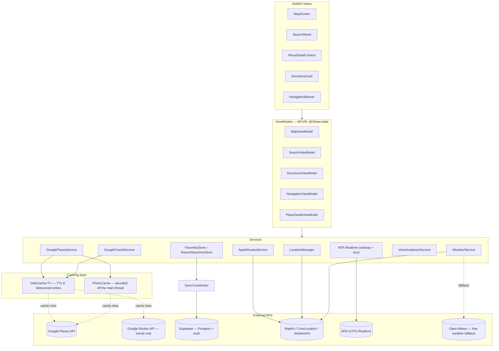

# Waypoint

Waypoint is an iOS maps app I'm building to practice SwiftUI and working with real APIs. The goal is basically a smaller version of Apple Maps — same look and feel, MapKit under the hood — but with richer place info (photos, ratings, reviews) pulled from Google Places, since Apple's built-in POI data is pretty bare.

Driving and walking routes, search and the map itself all run on Apple's frameworks. Google covers the two things Apple won't give a third-party app: place content, and transit directions.

*(screenshots coming soon)*

## What it does

- [x] Map centered on your current location, handles denied/restricted location permission
- [x] Search with a bottom sheet like Apple Maps — category shortcuts, autocomplete, recent searches, voice search
- [x] Custom map controls (3D, compass, map style, location) positioned like Apple Maps
- [x] Local Favorites/"Places" with a quick-add button
- [x] Weather widget using WeatherKit (needs the WeatherKit capability + paid dev account to actually show up)
- [x] Place detail sheet with photos, ratings, reviews, hours, phone number, website, and address (from Google Places)
- [x] In-app directions — Drive/Walk/Transit, route drawn right on the map, distance/ETA, no bouncing out to Apple Maps
- [x] Multi-stop routing — add extra stops and it routes through all of them, not just A to B
- [x] Turn-by-turn voice guidance and auto-reroute if you go off path
- [x] Course-up navigation camera that turns with you, tilts, and zooms out as you speed up
- [x] Speed limits and lane guidance on the navigation screen
- [x] Traffic incident reports, shared through Supabase
- [x] Trip persistence — a trip you leave survives the app being killed
- [x] Sign in with Apple or Google, with favorites and recents syncing across your devices
- [x] CarPlay
- [x] Home screen widgets and Live Activities

Check the [Roadmap](#roadmap) below for what's done vs. what's next.

## Built with

- Swift 6 / SwiftUI
- Liquid Glass UI (iOS 26+ only)
- MapKit for the map itself
- WeatherKit for the weather widget
- Speech framework + AVFoundation for voice search and voice guidance
- Google Places API for place content (photos, ratings, reviews, hours)
- Google Routes API for transit directions only — driving and walking run on MapKit
- Supabase (Postgres + Auth) for accounts, favorites/recents sync, and traffic reports
- Plain URLSession/async-await for networking — didn't want to pull in a networking library for a project this size
- MVVM
- XcodeGen to generate the Xcode project from `project.yml` (the `.xcodeproj` isn't committed)
- No CocoaPods, just Swift Package Manager

## Setup

### You'll need

- Xcode 26+ (I'm on the Xcode 27 beta)
- iOS 26+ simulator or device
- [Homebrew](https://brew.sh)
- A Google Cloud project with the Places API (New) turned on, and an API key

### Steps

1. Clone it:
   ```sh
   git clone https://github.com/<your-account>/waypoint-ios.git
   cd waypoint-ios
   ```
2. Get XcodeGen if you don't have it:
   ```sh
   brew install xcodegen
   ```
3. Copy the secrets template and drop in your own API key:
   ```sh
   cp Secrets.xcconfig.example Secrets.xcconfig
   # edit Secrets.xcconfig and set GOOGLE_PLACES_API_KEY
   ```
   `Secrets.xcconfig` is gitignored so your key doesn't end up on GitHub. Also worth restricting the key to iOS apps in Google Cloud Console and locking it to this bundle ID (`com.danielguzman.waypoint`).
4. Generate the project:
   ```sh
   xcodegen generate
   ```
5. Open `Waypoint.xcodeproj` and run it.
6. If you want the weather widget working, you need a paid Apple Developer account with WeatherKit enabled for your team — otherwise it just stays hidden and everything else still works fine.

See [TESTFLIGHT.md](TESTFLIGHT.md) for shipping a beta build to testers.

### Running the tests

```sh
xcodebuild test -project Waypoint.xcodeproj -scheme Waypoint \
  -destination 'platform=iOS Simulator,name=iPhone 17' -only-testing:WaypointTests
```

A handful of tests talk to live third-party endpoints — MTA Bus Time, Overpass, NYC Open Data.
They're skipped by default, because those are free shared services that interfere with each other
when the suite runs them back to back, and a busy endpoint shouldn't look like a broken app. Run
them deliberately when you want to check the real data path:

```sh
TEST_RUNNER_WAYPOINT_LIVE_TESTS=1 xcodebuild test ... -only-testing:WaypointTests
```

The `TEST_RUNNER_` prefix is required — `xcodebuild` only forwards variables named that way into
the test process, and strips the prefix on the way in. Without it the tests just skip.

## Project structure

```
Waypoint/
├── Waypoint/
│   ├── App/            # entry point
│   ├── Models/          # Place, Review, PlacePhoto, etc.
│   ├── ViewModels/      # MapViewModel, PlaceDetailViewModel, etc.
│   ├── Views/
│   │   ├── Map/
│   │   ├── PlaceDetail/
│   │   └── Search/
│   ├── Services/        # LocationManager, GooglePlacesService
│   └── Resources/
├── WaypointTests/
├── project.yml               # XcodeGen config, source of truth
├── Secrets.xcconfig          # gitignored, your real key goes here
├── Secrets.xcconfig.example
├── README.md
├── CHANGELOG.md
└── LICENSE
```

## Architecture

High-level view of how a screen turns into an API call (or, ideally, doesn't):



- **Views only talk to ViewModels** — every screen (`MapScreen`, `SearchSheet`, `PlaceDetailContent`, etc.) is plain SwiftUI reading `@Observable` state, no networking or persistence code in the view layer.
- **ViewModels own the async work** — they call into `Services` and publish results back to the view; this is the MVVM boundary.
- **Every billed Google call goes through the cache first** — `GooglePlacesService` and `GoogleTransitService` check `DiskCache` before making a network request, and only hit Google on a real miss. Photos go through a separate `PhotoCache` that also decodes bitmaps off the main thread so scrolling doesn't stutter.
- **`DiskCache<T>` is generic and TTL'd** — place details cache for 6 hours, nearby search for 2 hours (a week for "long-lived" categories like landmarks), transit routes for 3 minutes since departure times go stale fast. Writes are debounced so a burst of cache stores collapses into one disk write instead of rewriting the whole file each time.
- **Apple's own frameworks cover what doesn't need Google** — location, the base map, and weather (via WeatherKit, with a free/keyless Open-Meteo fallback if WeatherKit isn't available) never touch a billed API.
- **Real-time transit is its own path** — MTA subway/bus arrivals come from MTA's GTFS-Realtime protobuf feeds directly, not Google, and are fetched once per sheet open rather than polled continuously.
- **Favorites and recent searches work signed out, and sync when you sign in** — they live in on-device storage (`FavoritesStore`, `RecentSearchesStore`) and stay there if you never make an account. Signing in hands them to `SyncCoordinator`, which pushes to Supabase on local edits and pulls once at sign-in. Sync is whole-snapshot last-writer-wins, not a per-item merge; `SyncSnapshot` explains why.
- **Driving and walking routing is Apple's, not Google's** — `AppleRoutesService` wraps `MKDirections` for route alternates, multi-stop ordering, ETAs and reroutes. `GoogleTransitService` is the only routing call that leaves for Google, because MapKit won't return transit legs to a third-party app.

## Roadmap

**Done**
- [x] Map + location permission handling
- [x] Search
- [x] Recents/favorites, local and synced
- [x] Place detail sheet
- [x] In-app directions
- [x] Multi-stop routing
- [x] Voice guidance + auto-reroute
- [x] Accounts / sign in (Apple + Google, synced through Supabase)
- [x] CarPlay
- [x] Speed limits, lane guidance, traffic reports

**Maybe later**
- Saved lists
- Offline maps
- Android (probably not, but who knows)

## Notes

Solo project, just me working on it in feature branches. Not really looking for contributors right now but feel free to open an issue if something's broken.

## License

MIT — see [LICENSE](LICENSE).
